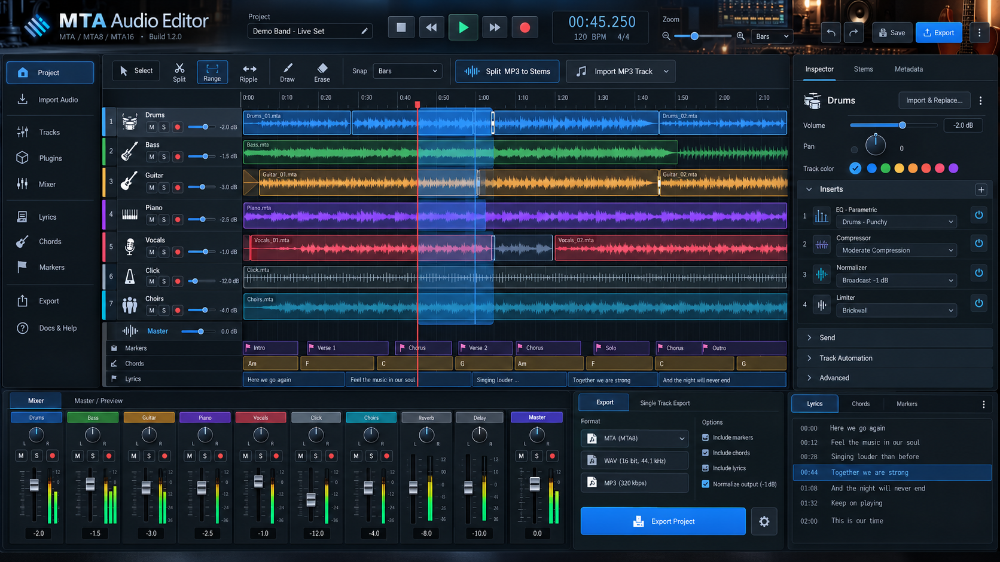

# MTA Audio Editor 0.2.0-8




Web DAW containerizzata per creare, importare, modificare ed esportare progetti multitraccia MTA destinati a M-Live/Merish ed equivalenti.

**Creatore:** Alessandro De Salvo <braket71@gmail.com>  
**Repository:** `desalvo/mta-audio-editor`  
**Licenza:** EUPL-1.2  
**Versione:** `0.2.0-8`  
**Build:** generato automaticamente nel formato `YYYYMMDD-HH:MM:SS`.

## Funzioni principali

- timeline grafica multitraccia in stile DAW con waveform e zoom;
- selezione e rimozione di segmenti su una o più tracce;
- taglio globale del brano con riallineamento di tutte le tracce e degli eventi temporali;
- ripple editing opzionale sulle tracce selezionate;
- editing non distruttivo basato su clip/regioni;
- import di nuove tracce e sostituzione di tracce esistenti;
- sincronizzazione manuale in millisecondi e automatica tramite correlazione dell'inviluppo audio;
- interfaccia completamente ridisegnata in stile DAW professionale, fedele al mockup incluso in `app/static/mockup-reference.png`;
- mixer con fader, pan, mute, solo, meter e master bus;
- import diretto di MP3/WAV e sostituzione di singole tracce;
- separazione MP3 in stems indipendenti tramite plugin Demucs, da aggiungere a un MTA esistente o nuovo;
- catene insert per traccia e master, fino a 16 effetti, con preset factory e preset custom persistenti: EQ parametrico/32-band, normalizer, compressor, limiter, delay, Lexicon-style reverb, room/ambience, amplify, stereo imager, maximizer/loudness, mastering wizard, de-noise e crackling cleaner;
- wizard globale **Auto Mix** reversibile con toggle e profili Balanced/Studio/Live/Gentle;
- preview master renderizzata applicando timeline, insert, mixer e processing master;
- export MTA8/MTA16, WAV PCM 24-bit/44.1 kHz, MP3 320 kbps e FLAC lossless;
- gestione testo, accordi e marker temporali;
- preservazione degli attachment MTA esistenti quando estraibili;
- estrazione read-only del MIDITK proprietario come file MIDI standard scaricabile dal progetto;
- documentazione utente e amministratore integrata e scaricabile in PDF.

## Avvio Docker

```bash
export MTA_ADMIN_PASSWORD='una-password-lunga-e-casuale'
docker compose up -d --build
```

La build production include per default il plugin Demucs. Per un’immagine core più piccola senza stem separation: `docker build --build-arg INSTALL_STEMS=false .`.

Aprire `http://localhost:8080`. L'autenticazione è abilitata per default; l'utente predefinito è `admin`, ma **non esiste una password predefinita**.

## Kubernetes

Creare il Secret applicativo fuori dal repository e poi applicare il manifest:

```bash
kubectl create secret generic mta-audio-editor-auth \
  --from-literal=username=admin \
  --from-literal=password='una-password-lunga-e-casuale'
kubectl apply -f k8s/deployment.yaml
kubectl port-forward svc/mta-audio-editor 8080:80
```

In produzione usare un Ingress/reverse proxy HTTPS e un gestore di secret appropriato.

## Documentazione

- `/docs/user` - manuale utente online, pubblico;
- `/docs/pdf/user` - manuale utente PDF;
- `/docs/admin` - manuale amministratore, protetto da autenticazione;
- `/docs/pdf/admin` - manuale amministratore PDF, protetto da autenticazione;
- `docs/SECURE_DEVELOPMENT.md` - baseline di sviluppo sicuro.
- `docs/PROJECT_ARCHITECTURE.md` - architettura progettuale, moduli, flussi dati e policy di release.
- `docs/MTA_FORMAT_RESEARCH.md` - risultati verificati del reverse engineering MTA e limiti di compatibilità.

## CI/CD GitHub

La pipeline `.github/workflows/ci-cd.yml` applica i gate prima di pubblicare immagini:

1. compile + Ruff;
2. unit/integration test e coverage minima 70%;
3. Bandit SAST;
4. `pip-audit` sulle dipendenze Python;
5. Gitleaks;
6. Trivy filesystem scan;
7. build immagine locale;
8. Trivy image scan;
9. smoke test autenticato e verifica delle route pubbliche/protette.

Solo dopo il superamento dei gate:

- push su `main` -> `desalvo/mta-audio-editor:latest`;
- push di un tag -> `desalvo/mta-audio-editor:<tag>`.

Le immagini sono pubblicate per `linux/amd64` e `linux/arm64`, con provenance e SBOM BuildKit.

### Secret GitHub richiesti

Definire come **Repository secrets**:

- `DOCKERHUB_USERNAME`
- `DOCKERHUB_TOKEN`

## Primo push e release

```bash
git init
git branch -M main
git remote add origin https://github.com/desalvo/mta-audio-editor.git
git add .
git commit -m "Release 0.2.0-8"
git push -u origin main
```

Dopo che la CI su `main` è verde, creare il tag:

```bash
git tag -s 0.2.0-8 -m "MTA Audio Editor 0.2.0-8"
git push origin 0.2.0-8
```

## Packaging locale

`./scripts/package.sh` aggiorna automaticamente `BUILD`, rigenera i PDF, esegue i production gate, rimuove cache/artefatti temporanei e genera lo ZIP versionato.

## Sicurezza e produzione

L'applicazione applica autenticazione default-on, request-integrity header sulle operazioni mutative, confinamento dei path, limiti upload, validation dei media, security header, container non-root/read-only e gate di sicurezza CI. Questo costituisce una baseline production-oriented, non una certificazione formale. TLS, secret management, backup, monitoring, network policy e validazione su hardware Merish restano responsabilità del deployment.

## Compatibilità MTA

Il layer container/import-export è isolato in `app/codec.py`; l'analisi proprietaria è isolata in `app/mta_reverse.py`. Gli attachment non audio già presenti vengono preservati quando tecnicamente estraibili e l'editor aggiunge `mta-editor.json` con il modello non distruttivo.

Sul corpus attuale di quattro file stock M-Live sono verificati in sola lettura: ID3v2.3, MtxInfoData XML, LYRICS/CHORDS temporizzati, COLORS con timing a centesimi e posizione progressiva di highlighting, e MIDITK ricostruito come Standard MIDI byte-exact con marker/tempo. Le sezioni condividono una keystream di 256 byte recuperabile dal file stesso. I campi ancora non documentati (per esempio alcuni sentinel COLORS) vengono riportati senza attribuire una semantica di scrittura.

La scrittura dei payload proprietari stock resta intenzionalmente disabilitata finché file controllati non vengono accettati da hardware M-Live/Merish reale. Il MIDI ricostruito da MIDITK viene salvato come sidecar nella directory di reverse-analysis ed è scaricabile tramite `GET /api/projects/{pid}/mta-miditk`. Vedere `docs/MTA_FORMAT_RESEARCH.md`.


## 0.2.0-3: extended mix, MTA slot mapping and reverse analysis

A project is no longer constrained to the final MTA8/MTA16 slot count while editing or mixing. You may keep any practical number of project tracks. MTA8 still exports at most 8 slots and MTA16 at most 16; when the project exceeds that capacity the export dialog requires every project track to be assigned to an output slot. Multiple tracks assigned to one slot are rendered and mixed into that single MTA stream with their inserts, fader, pan, mute and solo state applied.

Single tracks can be exported independently as WAV (24-bit), MP3 (320 kbps) or FLAC. The stereo master can also be exported as FLAC in addition to WAV/MP3.

Imported MTA files are analyzed by the reverse-engineering module (`app/mta_reverse.py`). It inventories Matroska streams/tags and attachments, fingerprints opaque payloads, parses embedded ID3v2.3 and MtxInfoData XML, and inspects the proprietary `LYRICS`, `CHORDS`, `COLORS` and `MIDITK` families. Corpus analysis now provides validated read-only decoding: LYRICS/CHORDS expose readable strings and minute/centisecond timestamps; COLORS exposes the 15-byte event layout, exact timing and progressive highlight position; MIDITK reconstructs byte-exact Standard MIDI and extracts tempo/Marker meta-events. Unknown fields and undocumented writer semantics remain preserved rather than rewritten speculatively.


## 0.2.0-8: verified proprietary read-only decoding

The reverse-analysis layer now recovers the shared 256-byte keystream, decodes LYRICS/CHORDS timing and text, decodes COLORS timing plus progressive highlight position, and reconstructs MIDITK as byte-exact Standard MIDI with tempo/marker meta-events. These capabilities are read-only by design until controlled writer round-trips are validated on target M-Live/Merish hardware. See `docs/MTA_FORMAT_RESEARCH.md` for byte-level evidence and confidence boundaries.

## 0.2.0-4: extended insert suite and Auto Mix

The insert registry now includes Delay, Lexicon-style Reverb, Room/Ambience, 32-band Graphic EQ, Amplify, Stereo Imager, Maximizer/Loudness, Mastering Wizard, De-Noise and Crackling Cleaner. Every processor includes safe factory presets and validated user-custom parameters. User presets are persisted in the data volume and appear as `user:<name>` in every project.

Auto Mix is a reversible project-level wizard. Before applying its rules it snapshots track faders, pan, insert chains and master processing. The selected Balanced, Studio, Live or Gentle profile then applies conservative type-aware headroom, stereo placement, EQ/dynamics/space processing and a master preparation chain. Turning Auto Mix off restores the saved snapshot exactly.

`Lexicon-style` identifies a preset family/working style only: the implementation uses open FFmpeg processing and is not a proprietary Lexicon algorithm or emulation.
