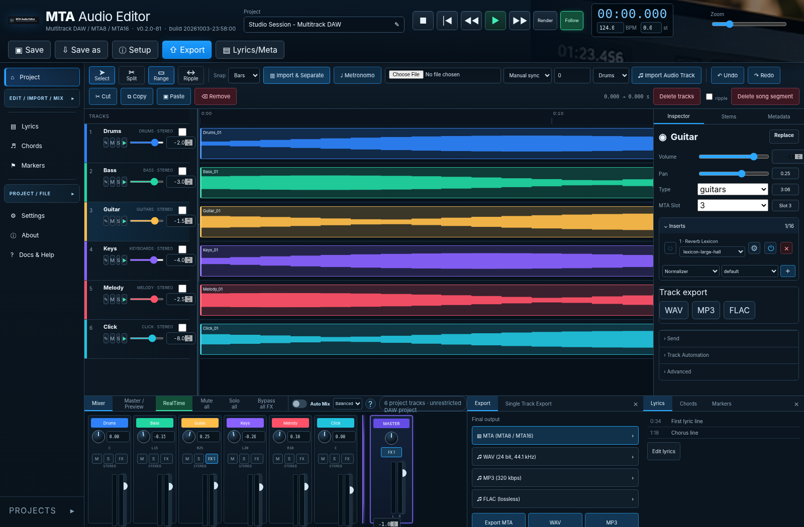

# MTA Audio Editor 0.2.0-93




Web DAW containerizzata per creare, importare, modificare ed esportare progetti multitraccia MTA destinati a M-Live/Merish ed equivalenti.

Alessandro De Salvo <braket71@gmail.com>  
**Repository:** `desalvo/mta-audio-editor`  
**Licenza:** EUPL-1.2  
**Versione:** `0.2.0-93`  
**Build:** generato automaticamente nel formato `YYYYMMDD-HH:MM:SS`.


## Manuali PDF / PDF manuals

**Italiano**
- [Manuale utente PDF](app/docs/MTA-Audio-Editor-User-Manual-IT.pdf)
- [Manuale amministratore PDF](app/docs/MTA-Audio-Editor-Administrator-Manual-IT.pdf)

**English**
- [User Manual PDF](app/docs/MTA-Audio-Editor-User-Manual-EN.pdf)
- [Administrator Manual PDF](app/docs/MTA-Audio-Editor-Administrator-Manual-EN.pdf)


## Brochure e specifiche MTA

- [Brochure prodotto PDF - Italiano](app/docs/MTA-Audio-Editor-Brochure-IT.pdf)
- [Product Brochure PDF - English](app/docs/MTA-Audio-Editor-Brochure-EN.pdf)
- [Specifica completa formato MTA PDF - Italiano](app/docs/MTA-Audio-Editor-MTA-Format-Specification-IT.pdf)
- [Complete MTA Format Specification PDF - English](app/docs/MTA-Audio-Editor-MTA-Format-Specification-EN.pdf)
- [README principale - English](README.md)

## Funzioni principali

- timeline grafica multitraccia in stile DAW con waveform e zoom;
- selezione e rimozione di segmenti su una o più tracce;
- taglio globale del brano con riallineamento di tutte le tracce e degli eventi temporali;
- ripple editing opzionale sulle tracce selezionate;
- editing non distruttivo basato su clip/regioni;
- import di nuove tracce e sostituzione di tracce esistenti;
- sincronizzazione manuale in millisecondi e automatica tramite correlazione dell'inviluppo audio;
- interfaccia DAW professionale e responsive; gli screenshot della documentazione sono acquisiti dall’applicazione reale;
- mixer con fader, pan, mute, solo, meter e master bus;
- import diretto di MP3/WAV e sostituzione di singole tracce;
- separazione MP3 in stems indipendenti tramite plugin Demucs, da aggiungere a un MTA esistente o nuovo;
- catene insert per traccia e master, fino a 16 effetti, con preset factory e preset custom persistenti: EQ parametrico/32-band, normalizer, compressor, limiter, delay, Lexicon-style reverb, room/ambience, amplify, stereo imager, maximizer/loudness, mastering wizard, de-noise e crackling cleaner;
- wizard globale **Auto Mix** reversibile con toggle e profili Balanced/Studio/Live/Gentle;
- preview master renderizzata applicando timeline, insert, mixer e processing master;
- export MTA8/MTA16, WAV PCM 24-bit/44.1 kHz, MP3 320 kbps e FLAC lossless;
- gestione testo, accordi e marker temporali;
- preservazione degli attachment MTA esistenti quando estraibili;
- estrazione read-only del MIDITK proprietario come file MIDI standard scaricabile dal progetto;
- documentazione utente e amministratore integrata e scaricabile in PDF.


## Gestione utenti e autenticazione

L'applicazione usa autenticazione multi-utente persistente su SQLite nel volume `/data/projects`. La schermata iniziale di login riprende fedelmente il mockup approvato, con layout fotografico/glassmorphism e variante responsive per smartphone.

- registrazione autonoma con **email obbligatoria**;
- conferma email tramite link prima di qualunque attivazione;
- approvazione/disattivazione degli account riservata agli amministratori;
- ruoli `admin` e `user`;
- TOTP opzionale RFC 6238 attivabile dal profilo, con QR code generato internamente;
- cambio email con nuova conferma e nuova approvazione;
- cambio/reset password;
- gestione SMTP/STARTTLS/SMTPS dal pannello amministrativo, con credenziali opzionali;
- password SMTP cifrata sul volume tramite chiave applicativa locale;
- notifica email a tutti gli amministratori con email confermata quando un utente viene attivato.

Al **primo avvio** devono essere definiti `MTA_ADMIN_USERNAME`, `MTA_ADMIN_PASSWORD` e `MTA_ADMIN_EMAIL`; questi valori creano il primo account amministratore. Per i link email dietro reverse proxy è raccomandato `MTA_PUBLIC_URL=https://mta.example.com`.

### Login social (Google, Facebook, GitHub)

I login OAuth social sono predisposti ma **disabilitati per default**. Gli utenti creati tramite provider social hanno email già verificata dal provider ma restano disabilitati fino all’approvazione di un amministratore; l’approvazione invia automaticamente una mail all’utente. Configurazione completa, callback e variabili Docker/Kubernetes: [`docs/SOCIAL_LOGIN.md`](docs/SOCIAL_LOGIN.md).

## Avvio Docker

```bash
export MTA_ADMIN_PASSWORD='una-password-lunga-e-casuale'
export MTA_ADMIN_EMAIL='admin@example.com'
docker compose up -d --build
```

La build production include per default il plugin Demucs. Per un’immagine core più piccola senza stem separation: `docker build --build-arg INSTALL_STEMS=false .`.

Aprire `http://localhost:8080`. L'autenticazione è abilitata per default. Al primo avvio l'account bootstrap viene creato solo se sono presenti password ed email amministrative; **non esistono credenziali predefinite**.


## Workspace utenti, condivisione e archivi completi

Ogni utente vede un workspace dedicato contenente i progetti di cui è proprietario e quelli condivisi con lui. Il proprietario può condividere un progetto con un altro account attivo e con email confermata; il collaboratore può aprire e modificare il progetto, mentre condivisioni ed eliminazione del progetto restano riservate al proprietario (o a un amministratore).

Per ogni progetto è disponibile una gestione file con elenco, download, upload di file originali aggiuntivi e cancellazione dei file non referenziati. Gli upload audio e i file MTA importati vengono conservati anche nella directory `originals/` del progetto, così i dump contengono sia lo stato corrente sia i file originari.

È possibile:
- esportare un intero progetto come archivio `.mta-project.zip`;
- importare un archivio progetto completo, che viene assegnato all'utente che lo importa;
- esportare/importare normalmente MTA, audio e singole tracce;
- come amministratore, scaricare un dump ZIP di tutti i progetti di tutti gli utenti tramite il pannello utenti.

Gli archivi completi includono `project.json`, audio, attachment, sorgente MTA, file originali e gli altri artefatti presenti nel progetto.

## Kubernetes / Kustomize

I manifest sono separati in `k8s/base/namespace.yaml`, `pvc.yaml`, `deployment.yaml` e `service.yaml`. `secret.example.yaml` è volutamente escluso dal Kustomization di base. Sono inclusi due overlay di esempio:

```bash
kubectl apply -k k8s/overlays/nginx
kubectl apply -k k8s/overlays/haproxy
```

Per generare manifest locali personalizzati è disponibile un wizard standalone auto-aggiornante:

```bash
curl -fsSLo mta-k8s-wizard.py \
  https://raw.githubusercontent.com/desalvo/mta-audio-editor/main/scripts/k8s-wizard.py
python3 mta-k8s-wizard.py
```

Il wizard propone prima i default e nei run successivi gli ultimi valori usati. Il limite di upload predefinito è **1024 MB** ed è applicato sia all'applicazione sia alle annotazioni Ingress; può essere modificato interattivamente o con `--max-upload-mb <MB>` e `--image-pull-policy Always|IfNotPresent|Never`. Richiede username/password amministrativi, StorageClass del PVC, namespace e `nodeSelector`; consente inoltre di scegliere Ingress NGINX/HAProxy/nessuno, host e immagine. La configurazione locale usa permessi `0600`; usare `--no-save-password` per non persistere la password. Se trova una versione del wizard più nuova su GitHub aggiorna atomicamente il proprio file e si riavvia automaticamente.

## Android e iOS/iPadOS

Il repository include client nativi in `mobile/android` e `mobile/ios`. Le app mobile si collegano via HTTPS al backend MTA Audio Editor Docker/Kubernetes, riutilizzano l'interfaccia responsive e aggiungono integrazione nativa con Files/Storage Access Framework per import, export, scelta destinazione e condivisione. Al primo avvio usano automaticamente il servizio preconfigurato: non viene richiesto alcun URL e l'indirizzo predefinito non viene mostrato. Un URL personalizzato può essere impostato successivamente nelle Impostazioni server; solo il valore custom può essere visualizzato/modificato dall'utente. Demucs, rendering FFmpeg e generazione MTA restano server-side. La CI produce APK/AAB Android e un archivio iOS; con i secret di firma produce anche AAB/IPA distribuibili e può inviare l'IPA a TestFlight sui tag. Vedi `docs/MOBILE_APPS.md`.

## Documentazione

### Mappa della documentazione

| Documento | Contenuto |
|---|---|
| `app/docs/MTA-Audio-Editor-User-Manual-IT.pdf` / `-EN.pdf` | manuale utente completo italiano/inglese con screenshot, esempi e workflow |
| `app/docs/MTA-Audio-Editor-Administrator-Manual-IT.pdf` / `-EN.pdf` | amministrazione, sicurezza, architettura, mobile e specifica MTA |
| `docs/MTA_FORMAT_FINAL_SPEC_IT.md` / `docs/MTA_FORMAT_FINAL_SPEC_EN.md` | specifica tecnica MTA consolidata IT/EN |
| `docs/MTA_FORMAT_FINAL_SPEC.md` | alias inglese della specifica tecnica consolidata |
| `docs/MTA_FORMAT_RESEARCH.md` | note tecniche e cronologia di validazione del formato |
| `docs/PROJECT_ARCHITECTURE.md` | architettura software e flussi end-to-end |
| `docs/DATA_MODEL.md` | modello dati e persistenza |
| `docs/API_REFERENCE.md` | mappa API e convenzioni HTTP |
| `docs/OPERATIONS_RUNBOOK.md` | esercizio, Kubernetes, backup, troubleshooting |
| `docs/TESTING_AND_RELEASE.md` | test, CI/CD e criteri di release |
| `docs/SECURE_DEVELOPMENT.md` | regole di sviluppo sicuro |


- `/docs/user` - manuale utente online, pubblico;
- `/docs/pdf/user` - manuale utente PDF;
- `/docs/admin` - manuale amministratore, protetto da autenticazione;
- `/docs/pdf/admin` - manuale amministratore PDF, protetto da autenticazione;
- `docs/SECURE_DEVELOPMENT.md` - baseline di sviluppo sicuro.
- `docs/PROJECT_ARCHITECTURE.md` - architettura progettuale, moduli, flussi dati e policy di release.
- `docs/MTA_FORMAT_RESEARCH.md` - note di validazione tecnica del formato MTA e limiti di compatibilità.

## CI/CD GitHub

La pipeline `.github/workflows/ci-cd.yml` applica i gate prima di pubblicare immagini:

1. compile + Ruff;
2. unit/integration test e coverage minima 70%;
3. Bandit SAST;
4. `pip-audit` sulle dipendenze Python;
5. Gitleaks;
6. Trivy filesystem scan;
7. build immagine locale;
8. Trivy image scan;
9. smoke test autenticato e verifica delle route pubbliche/protette.

Solo dopo il superamento dei gate:

- push su `main` -> `desalvo/mta-audio-editor:latest`;
- push di un tag -> `desalvo/mta-audio-editor:<tag>`.

Le immagini sono pubblicate per `linux/amd64` e `linux/arm64`, con provenance e SBOM BuildKit.

### Secret GitHub richiesti

Definire come **Repository secrets**:

- `DOCKERHUB_USERNAME`
- `DOCKERHUB_TOKEN`

## Primo push e release

```bash
git init
git branch -M main
git remote add origin https://github.com/desalvo/mta-audio-editor.git
git add .
git commit -m "Release 0.2.0-93"
git push -u origin main
```

Dopo che la CI su `main` è verde, creare il tag:

```bash
git tag -s 0.2.0-93 -m "MTA Audio Editor 0.2.0-93"
git push origin 0.2.0-93
```

## Packaging locale

`./scripts/package.sh` aggiorna automaticamente `BUILD_INFO`, rigenera i PDF, esegue i production gate, rimuove cache/artefatti temporanei e genera lo ZIP versionato.

## Sicurezza e produzione

L'applicazione applica autenticazione default-on, request-integrity header sulle operazioni mutative, confinamento dei path, limiti upload, validation dei media, security header, container non-root/read-only e gate di sicurezza CI. Questo costituisce una baseline production-oriented, non una certificazione formale. TLS, secret management, backup, monitoring, network policy e validazione su hardware Merish restano responsabilità del deployment.

## Compatibilità MTA

Il layer container/import-export è isolato in `app/codec.py`; l'analisi proprietaria è isolata in `app/mta_reverse.py`. Gli attachment non audio già presenti vengono preservati quando tecnicamente estraibili e l'editor aggiunge `mta-editor.json` con il modello non distruttivo.

Sul corpus attuale di quattro file stock M-Live sono verificati in sola lettura: ID3v2.3, MtxInfoData XML, LYRICS/CHORDS temporizzati, COLORS con timing a centesimi e posizione progressiva di highlighting, e MIDITK ricostruito come Standard MIDI byte-exact con marker/tempo. Le sezioni condividono una keystream di 256 byte recuperabile dal file stesso. I campi ancora non documentati (per esempio alcuni sentinel COLORS) vengono riportati senza attribuire una semantica di scrittura.

La scrittura dei payload proprietari stock resta intenzionalmente disabilitata finché file controllati non vengono accettati da hardware M-Live/Merish reale. Il MIDI ricostruito da MIDITK viene salvato come sidecar nella directory di format-analysis ed è scaricabile tramite `GET /api/projects/{pid}/mta-miditk`. Vedere `docs/MTA_FORMAT_RESEARCH.md`.


## 0.2.0-3: extended mix, MTA slot mapping and format analysis

A project is no longer constrained to the final MTA8/MTA16 slot count while editing or mixing. You may keep any practical number of project tracks. MTA8 still exports at most 8 slots and MTA16 at most 16; when the project exceeds that capacity the export dialog requires every project track to be assigned to an output slot. Multiple tracks assigned to one slot are rendered and mixed into that single MTA stream with their inserts, fader, pan, mute and solo state applied.

Single tracks can be exported independently as WAV (24-bit), MP3 (320 kbps) or FLAC. The stereo master can also be exported as FLAC in addition to WAV/MP3.

Imported MTA files are analyzed by the MTA format parser (`app/mta_reverse.py`). It inventories Matroska streams/tags and attachments, fingerprints opaque payloads, parses embedded ID3v2.3 and MtxInfoData XML, and inspects the proprietary `LYRICS`, `CHORDS`, `COLORS` and `MIDITK` families. Corpus analysis now provides validated read-only decoding: LYRICS/CHORDS expose readable strings and minute/centisecond timestamps; COLORS exposes the 15-byte event layout, exact timing and progressive highlight position; MIDITK reconstructs byte-exact Standard MIDI and extracts tempo/Marker meta-events. Unknown fields and undocumented writer semantics remain preserved rather than rewritten speculatively.


## Python and dependency policy

La baseline production e CI è **Python 3.14**. Questa release assorbe la precedente PR Docker verso `python:3.14-slim-bookworm` e abilita NumPy 2.5.3, che supporta Python 3.12-3.15. Il plugin stems usa Demucs 4.1.0; l'immagine verifica anche PyTorch 2.14.1, che pubblica wheel CPython 3.14 per amd64 e arm64. Dependabot può quindi aggiornare normalmente Python/NumPy entro questa baseline; Python 3.15 resta escluso finché PyTorch/Demucs e i gate multi-arch non vengono validati.

Il security job usa checkout Git completo per permettere a Gitleaks di analizzare correttamente le pull request Dependabot.

## 0.2.0-9: verified proprietary read-only decoding

The format-analysis layer now recovers the shared 256-byte keystream, decodes LYRICS/CHORDS timing and text, decodes COLORS timing plus progressive highlight position, and reconstructs MIDITK as byte-exact Standard MIDI with tempo/marker meta-events. These capabilities are read-only by design until controlled writer round-trips are validated on target M-Live/Merish hardware. See `docs/MTA_FORMAT_RESEARCH.md` for byte-level evidence and confidence boundaries.

## 0.2.0-4: extended insert suite and Auto Mix

The insert registry now includes Delay, Lexicon-style Reverb, Room/Ambience, 32-band Graphic EQ, Amplify, Stereo Imager, Maximizer/Loudness, Mastering Wizard, De-Noise and Crackling Cleaner. Every processor includes safe factory presets and validated user-custom parameters. User presets are persisted in the data volume and appear as `user:<name>` in every project.

Auto Mix is a reversible project-level wizard. Before applying its rules it snapshots track faders, pan, insert chains and master processing. The selected Balanced, Studio, Live or Gentle profile then applies conservative type-aware headroom, stereo placement, EQ/dynamics/space processing and a master preparation chain. Turning Auto Mix off restores the saved snapshot exactly.

`Lexicon-style` identifies a preset family/working style only: the implementation uses open FFmpeg processing and is not a proprietary Lexicon algorithm or emulation.


### Python 3.14 dependency compatibility

The 0.2.x Python 3.14 baseline pins Pydantic 2.12.5 for deterministic CPython 3.14 wheel resolution in GitHub Actions. NumPy remains 2.5.3 and Demucs 4.1.0.


### Kubernetes wizard: TLS termination

The manifest wizard supports TLS termination for NGINX and HAProxy Ingress. With HAProxy and TLS termination enabled it emits `haproxy-ingress.github.io/ssl-redirect: "true"`. When TLS termination is enabled, a `tls:` section is always generated: specify `--tls-secret <name>` to reference a Kubernetes TLS Secret, or leave it empty to use the Ingress Controller's default TLS certificate/secret.

## Multi-user authentication

MTA Audio Editor now uses application-managed users and a photographic, responsive login page. Self-registration requires a unique username, a mandatory email address and a password of at least 10 characters. The email must be confirmed before an administrator can activate the account. Only administrators can activate/deactivate users, change roles or delete other users.

The first administrator can be bootstrapped with `MTA_ADMIN_USERNAME`, `MTA_ADMIN_PASSWORD` and `MTA_ADMIN_EMAIL`. Each user can optionally enable TOTP from the profile page; the application generates the secret and an in-app QR code compatible with standard authenticator apps. SMTP/SMTPS/STARTTLS configuration is available to administrators under **Administration → SMTP / SMTPS** and is used for email confirmation plus activation notifications. When an account is activated, all active administrators with a confirmed email address receive a notification. Set `MTA_PUBLIC_URL` when the externally reachable application URL cannot be inferred from the incoming request/proxy.

### Social login (Google, Facebook, GitHub)

OAuth social providers are prepared but **disabled by default**. Social users receive a provider-verified email status but remain disabled until administrator approval; approval automatically sends the activation email. See [`docs/SOCIAL_LOGIN.md`](docs/SOCIAL_LOGIN.md) for provider callbacks and Docker/Kubernetes variables.

### Upgrade Kubernetes e readiness

Dalla 0.2.0-73 il pod imposta `fsGroup: 10001` e `fsGroupChangePolicy: OnRootMismatch` per rendere scrivibile il PVC all'utente applicativo non-root. La chiave `email` del Secret bootstrap è opzionale a runtime per mantenere compatibili gli upgrade da release precedenti; il wizard continua comunque a richiedere l'email per le nuove installazioni. È inoltre presente una `startupProbe` su `/api/health` prima di readiness e liveness.

Se un pod resta non Ready dopo un upgrade, controllare `kubectl describe pod` per `CreateContainerConfigError`, `permission denied` sul PVC o errori della probe.


## Edizioni native Windows e macOS

La stessa applicazione viene prodotta dalla CI anche come desktop nativo mono-utente:

| Piattaforma | Artefatto CI | Modalità |
|---|---|---|
| Windows x64 | `MTA-Audio-Editor-<version>-Windows-x64-Setup.exe` | installer per-user Inno Setup |
| macOS Intel | `MTA-Audio-Editor-<version>-macOS-x64.dmg` | `.app` drag-to-Applications |
| macOS Apple Silicon | `MTA-Audio-Editor-<version>-macOS-arm64.dmg` | `.app` drag-to-Applications |

Le edizioni native non espongono login o gestione utenti: sono applicazioni locali mono-utente. L'engine FastAPI resta interno all'applicazione e ascolta soltanto su `127.0.0.1`; l'interfaccia è visualizzata in una finestra `pywebview`. FFmpeg/FFprobe e lo stack Demucs/PyTorch vengono inclusi nel pacchetto; i modelli Demucs vengono scaricati al primo utilizzo e messi in cache nella directory dati dell'utente.

Persistenza:

```text
macOS   ~/Library/Application Support/MTA Audio Editor
Windows %LOCALAPPDATA%\MTA Audio Editor
```

Il workflow `.github/workflows/ci-cd.yml` esegue il build nativo dopo i gate Quality/Security, avvia l'eseguibile con `--native-smoke`, costruisce gli installer e ne pubblica gli artifact. Su un tag Git gli installer vengono inoltre aggiunti automaticamente alla GitHub Release.

> Gli installer generati dalla CI non sono firmati/notarizzati finché non vengono configurati certificati Apple/Windows nel processo di release. La firma del codice è distinta dalla validazione funzionale dell'applicazione.


---

# English

MTA Audio Editor is a DAW-style application for creating, importing, editing and exporting **MTA (Multi Track Audio)** projects. It can create new MTA8/MTA16 projects from audio tracks or separated stems, export the full project as MTA, WAV, MP3 or FLAC, and export individual tracks as WAV, MP3 or FLAC.

## PDF manuals

- [User Manual - English (PDF)](app/docs/MTA-Audio-Editor-User-Manual-EN.pdf)
- [Administrator Manual - English (PDF)](app/docs/MTA-Audio-Editor-Administrator-Manual-EN.pdf)
- [Manuale utente - Italiano (PDF)](app/docs/MTA-Audio-Editor-User-Manual-IT.pdf)
- [Manuale amministratore - Italiano (PDF)](app/docs/MTA-Audio-Editor-Administrator-Manual-IT.pdf)

## Main capabilities

- multitrack timeline with persistent waveforms, zoom and non-destructive clips;
- synchronized dynamic playback with buffering, Render preview, Follow and real-time meters;
- live mixer controls for level, pan, mute/solo and FX state;
- editable per-track MTA slot assignment plus device-aware MTA8/MTA16 mapping;
- insert FX with factory/user presets, immediate parameter refresh and synchronized rotary/numeric controls;
- stem separation through Demucs;
- project and individual-track exports;
- native Windows/macOS clients and Android/iOS/iPadOS clients.

The online/server and mobile editions use user accounts, optional TOTP and project sharing. Mobile apps rely on the cloud/remote server for heavy processing such as FFmpeg rendering, MTA generation and Demucs. Local native desktop single-user mode does not require those account features.
### Formati di progetto

- **Multitrack DAW**: formato progetto consigliato per editing/mix generale, senza limite MTA di 8/16 tracce. WAV/MP3/FLAC si esportano direttamente; per un export MTA si sceglie MTA8 o MTA16 in quella fase.
- **MTA8 / MTA16**: formati progetto orientati fin dall’inizio ai rispettivi limiti e profili hardware.


### Project formats

- **Multitrack DAW**: recommended general editing/mixing project format, without the MTA 8/16-track limit. WAV/MP3/FLAC export directly; MTA8 or MTA16 is selected only when an MTA export is requested.
- **MTA8 / MTA16**: project formats intended to follow the respective hardware/output limits from the start.
